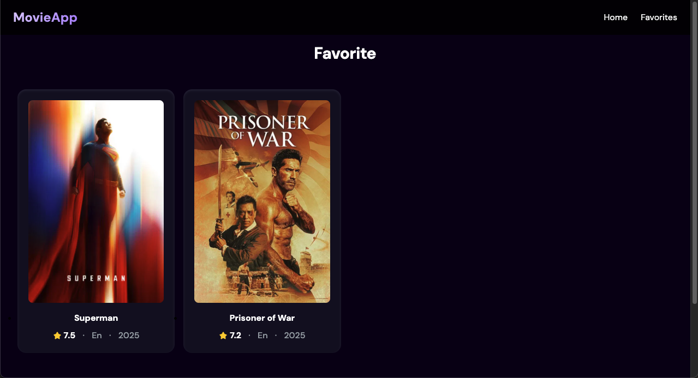

# 🎬 React Movie Search App

Built with **React**, **TMDB API**, **Tailwind CSS**, **Express.js**, **PostgreSQL**, **Supabase** and deployed on **Vercel**.   

🚀 **Live Demo**: [react-tmdb-movie-search.vercel.app](https://react-tmdb-movie-search.vercel.app/)  
📂 **Source Code**: [GitHub Repository](https://github.com/ting-haoliu/react-movie-search-app.git)
👤 **Test User**  
Email:    test@test
Password: 123456

---

## Features

- **Movie Search**: Search for movies from the TMDB database by keyword.
    - Includes **debounce optimization** to reduce API calls.
- **Popular Movies**: Homepage displays the top 20 most popular movies.  
- **Trending Movies**: Shows this week's trending movies.  
- **Movie Detail Page**: Click on any movie card to view detailed information.
- **User Authentication (Supabase + PostgreSQL)**:
    - Implemented sign-up, login, and logout using Supabase Auth.
    - User profiles and favorite data are stored in PostgreSQL through Supabase.
- **Favorite Movies**:  
    - Logged-in users can mark or unmark movies as favorites.  
    - Favorites are stored and synced in the **Supabase** database
    - A dedicated **Favorites Page** lists all saved movies.  
- **Responsive Web Design (RWD)**: Fully responsive layout that works seamlessly on desktops, tablets, and mobile devices.

---

## Tech Stack

- **React**  
- **React Router**  
- **Tailwind CSS**  
- **TMDB API** ([The Movie Database](https://www.themoviedb.org/documentation/api))  
- **PostgreSQL**
- **Supabase**
- **Vercel** (Deployment)

---

## Installation & Usage

1. **Clone the repo**
    ```bash
    git clone git@github.com:ting-haoliu/react-movie-search-app.git
    cd react-movie-search-app
2. **Install dependencies**
    ```bash
    npm install
3. **Set up environment variables:**
    Create a .env file in the root directory and add your API keys
    ```bash
    VITE_TMDB_API_KEY=your_tmdb_api_key

    VITE_SUPABASE_URL=your_supabase_project_url
    VITE_SUPABASE_ANON_KEY=your_supabase_anon_key
4. **Run the development server**
    ```bash
    npm run dev
## Screenshots

### Homepage


### Trending


### Movie Details


### Sign Up and Sign In


### Favorite


## License
MIT License