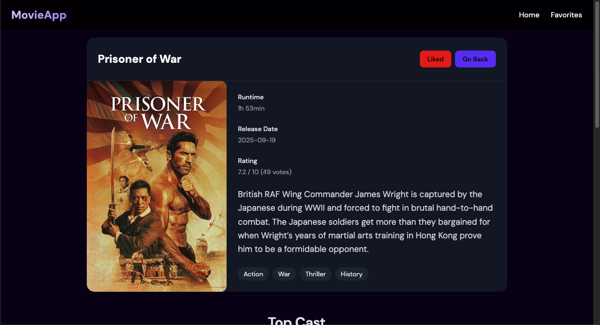
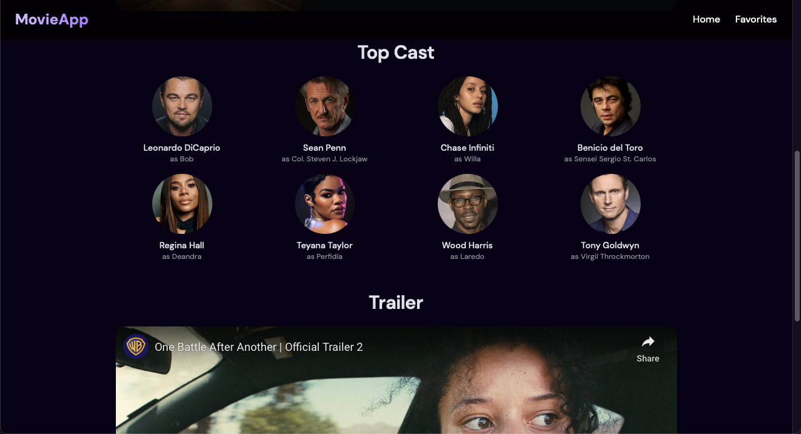

# 🎬 React Movie Search App

Built with **React**, **TMDB API**, **Tailwind CSS**, and deployed on **Vercel**.   

🚀 **Live Demo**: [react-tmdb-movie-search.vercel.app](https://react-tmdb-movie-search.vercel.app/)  
📂 **Source Code**: [GitHub Repository](https://github.com/ting-haoliu/react-movie-search-app.git)


---

## Features

- **Movie Search**: Search for movies from the TMDB database by keyword.
    - Includes **debounce optimization** to reduce API calls.
- **Popular Movies**: Homepage displays the top 20 most popular movies.  
- **Trending Movies**: Shows this week's trending movies.  
- **Movie Detail Page**: Click on any movie card to view detailed information, including:
    - Title  
    - Runtime  
    - Release Date  
    - Rating  
    - Overview  
    - Genres
    - Cast
    - Trailer
- **Favorite Movies**:  
    - Users can mark/unmark movies as favorite.  
    - Favorites are **persisted in localStorage** so they remain after refresh.  
    - A dedicated **Favorites Page** lists all saved movies.  
- **Responsive Web Design (RWD)**: Fully responsive layout that works seamlessly on desktops, tablets, and mobile devices.

---

## Tech Stack

- **React**  
- **React Router**  
- **Tailwind CSS**  
- **TMDB API** ([The Movie Database](https://www.themoviedb.org/documentation/api))  
- **Vercel** (Deployment)

---

## Installation & Usage

1. **Clone the repo**
    ```bash
    git clone git@github.com:ting-haoliu/react-movie-search-app.git
    cd react-movie-search-app
2. **Install dependencies**
    ```bash
    npm install
3. **Set up environment variables**
    Create a .env file in the root directory and add your TMDB API key:
    ```bash
    VITE_TMDB_API_KEY=your_tmdb_api_key
4. **Run the development server**
    ```bash
    npm run dev

## Screenshots

### Homepage


### Trending


### Movie Details



### Favorite


## License
MIT License