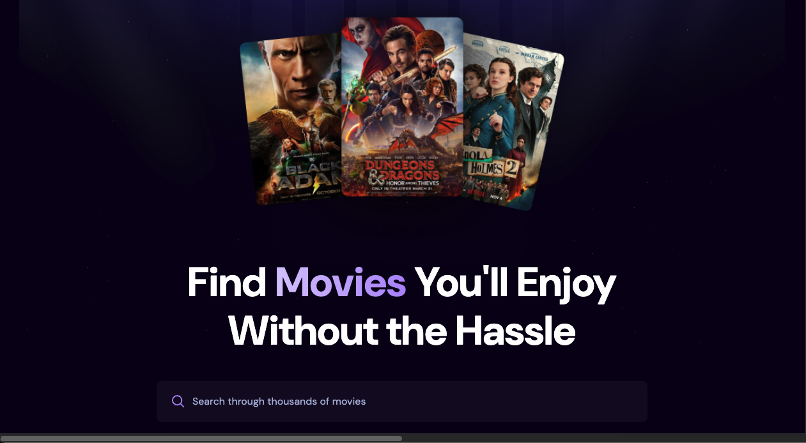

# 🎬 React Movie Searching Website

A movie searching website built with **React** and **TMDB API**, featuring search, popular movies, trending movies, and detailed movie information.  
Deployed on **Vercel**:  
👉 [Live Demo](https://react-movie-searching.vercel.app/)

---

## Features

- **Movie Search**: Search for movies from the TMDB database by keyword.
    - Optimized with **debounce** to reduce unnecessary API requests and improve performance.
- **Popular Movies**: Homepage displays the top 20 most popular movies.  
- **Trending Movies**: Shows this week's trending movies.  
- **Movie Detail Page**: Click on any movie card to view detailed information, including:
  - Title  
  - Runtime  
  - Release Date  
  - Rating  
  - Overview  
  - Genres
- **Responsive Web Design (RWD)**: Fully responsive layout that works seamlessly on desktops, tablets, and mobile devices.

---

## Tech Stack

- **React**  
- **React Router**  
- **Tailwind CSS**  
- **TMDB API** ([The Movie Database](https://www.themoviedb.org/documentation/api))  
- **Vercel** (Deployment)

---

## Installation & Usage

1. **Clone the repo**
    ```bash
    git clone git@github.com:ting-haoliu/react-movie_searching.git
    cd react-movie_searching
2. **Install dependencies**
    ```bash
    npm install
3. **Set up environment variables**
    Create a .env file in the root directory and add your TMDB API key:
    ```bash
    VITE_TMDB_API_KEY=your_tmdb_api_key
4. **Run the development server**
    ```bash
    npm run dev
## Screenshots

### Homepage


### Trending


### Movie Details


## License
MIT License